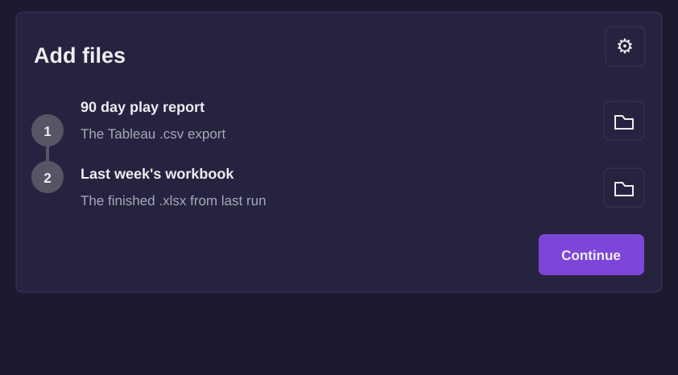
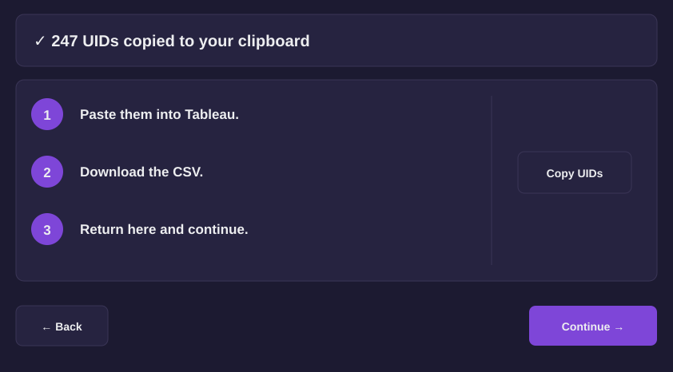
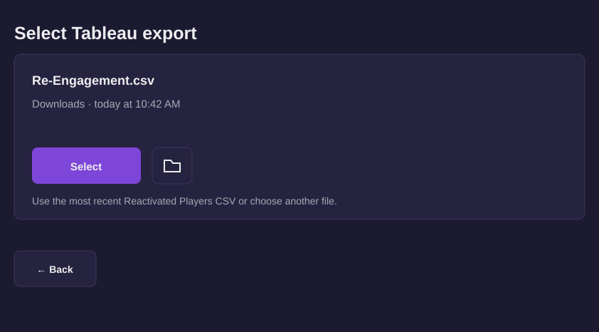
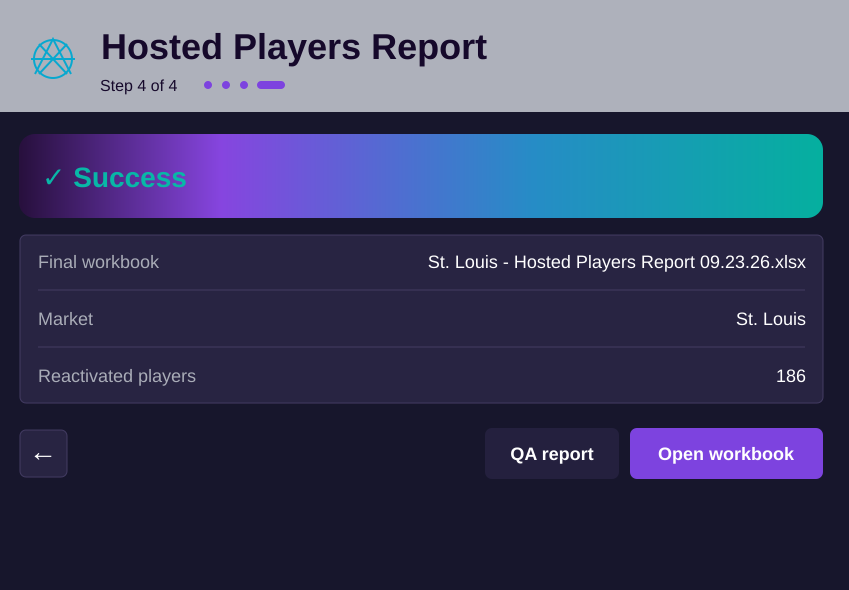

# Reactivation Report

A Windows desktop application for building hosted-player reactivation reports from Tableau exports and Excel workbooks.

<p>
  <a href="https://github.com/christianwirick/ReactivationReport/releases/latest"></a>
  
  
  
  
</p>

Reactivation Report compares this week's hosted-player export with the previous workbook, identifies players who need a reactivation lookup, guides the Tableau handoff, and builds a validated Excel report.

## Download

### Latest release: [v1.1.0](https://github.com/christianwirick/ReactivationReport/releases/tag/v1.1.0)

Published July 16, 2026. Version 1.1.0 includes the updated four-step GUI, automatic native PivotTables when desktop Excel is available, optional QA output, smoother file selection, and expanded reconciliation coverage.

<p>
  <a href="https://github.com/christianwirick/ReactivationReport/releases/latest">
    
  </a>
</p>

The release page includes the Windows ZIP, SHA256 checksum, and manifest.

## Application workflow

<table>
  <tr>
    <td width="50%">
      <strong>1. Add files</strong><br>
      Select the current 90 day play report and last week's finished workbook.<br><br>
      
    </td>
    <td width="50%">
      <strong>2. Get reactivated players</strong><br>
      Missing UIDs are copied for the Tableau lookup workflow.<br><br>
      
    </td>
  </tr>
  <tr>
    <td width="50%">
      <strong>3. Add the Tableau export</strong><br>
      Use the latest Re-Engagement CSV from Downloads or choose another file.<br><br>
      
    </td>
    <td width="50%">
      <strong>4. Complete the report</strong><br>
      Build, validate, and open the finished Excel workbook.<br><br>
      
    </td>
  </tr>
</table>

## Features

- **Guided four-step workflow** for weekly report production.
- **Current-vs-prior comparison** to identify missing UIDs.
- **Tableau clipboard handoff** for reactivation lookup.
- **Excel workbook generation** with formatted report sheets.
- **Native PivotTables** when desktop Excel automation is available, with a static fallback when it is not.
- **Validation and reconciliation** before the final workbook is published.
- **Diagnostics and logging** for troubleshooting failed runs.

## Quick start

### Requirements

- Windows
- Python 3.11 or newer

### First setup

1. [Download the latest release](https://github.com/christianwirick/ReactivationReport/releases/latest).
2. Extract the ZIP to a local folder.
3. Double-click `setup_and_run_gui.bat`.

Setup creates a per-user Python environment and opens the application.

### Weekly use

Double-click:

```text
run_gui.bat
```

Run setup again after installing a new release. If setup or launch fails, run `check_env.bat`.

## How the report is created

### Step 1 — Add files

Choose this week's Hosted Players / 90 day play report CSV and last week's finished workbook.

### Step 2 — Tableau handoff

The application compares the two files and copies the missing UIDs to the clipboard. Paste those UIDs into Tableau and export the Reactivated Players CSV. If no UIDs are missing, no clipboard handoff is required.

### Step 3 — Add the export

Return to the application and use the most recent Re-Engagement CSV from Downloads or select another CSV manually.

### Step 4 — Build and open

The application builds and validates the workbook, then lets you open the finished report.

```text
<Market> - Hosted Players Report MM.DD.YY.xlsx
```

## Command line

The GUI is the primary workflow. The CLI is available for troubleshooting and repeatable runs.

From the extracted application folder:

```bat
"%LOCALAPPDATA%\HostedPlayersReport\.venv\Scripts\python.exe" cli.py ^
  --hosted-csv "C:\Path\To\Hosted Players.csv" ^
  --last-week-xlsx "C:\Path\To\Last Week.xlsx" ^
  --reactivated-csv "C:\Path\To\Re-Engagement.csv"
```

See all options:

```bat
"%LOCALAPPDATA%\HostedPlayersReport\.venv\Scripts\python.exe" cli.py --help
```

## Troubleshooting

- **Missing Python:** Run `check_env.bat`. Install Python 3.11 or newer, or set `HOSTED_PLAYERS_PYTHON` to the full path of `python.exe`.
- **Locked workbook:** Close it in Excel, wait for OneDrive to finish syncing, then retry.
- **CSV file not accepted:** Export the file from Tableau as UTF-16 tab-delimited text.
- **Native PivotTables fail:** Install desktop Excel and rerun setup. The application can still create static summary sheets.
- **Support diagnostics:** Send `%APPDATA%\HostedPlayersReport\app.log` and the diagnostic ID shown by the application.

## Releases

See [all releases](https://github.com/christianwirick/ReactivationReport/releases) for version history, downloadable ZIPs, manifests, checksums, and release notes.
